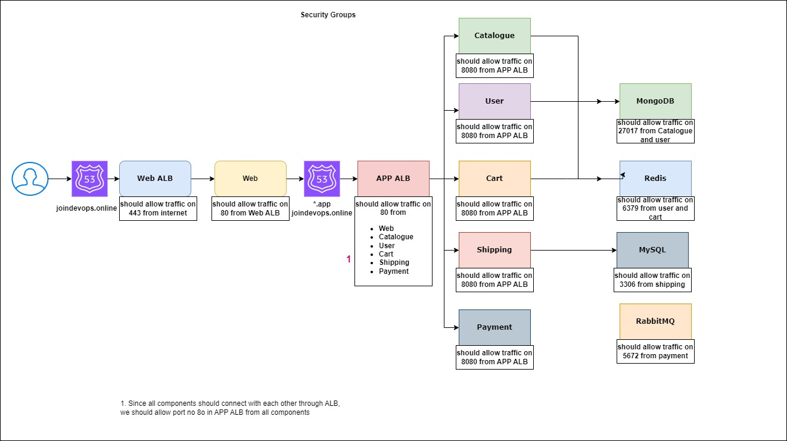

# Heading 1
- Orange
- Apple
- Banana
* pine apple
* papaya

## Heading 2
1. First
2. Second

- [Devi github ](https://github.com/DeviSohit)
- 
- 

### Heading 3
To write a command: `sh helloworld.sh`

#### Heading 4

```yaml
- name: Install cart component
  hosts: cart
  become: yes
  tasks:
  - name: setup NPM source
    ansible.builtin.shell: "curl -sL https://rpm.nodesource.com/setup_lts.x | bash"

  - name: Install NodeJS
    ansible.builtin.yum:
      name: nodejs
      state: installed
```

##### Heading 5

###### Heading 6
